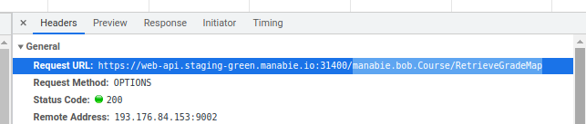
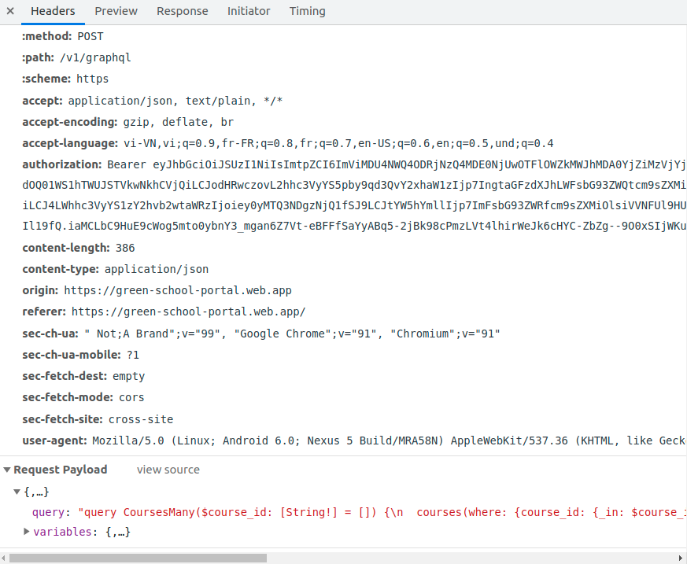

# CMS World

This pages will description all issues in `supports/cms-world.ts`.

Hope can help all you guys find your issue quickly


## Common functions
| Name | Functionality |
| - | - |
| connect | Connect to CMS. Must to call before start a Scenario. It will trigger by `@cms` tag |
| quit | Quit out CMS. Must to call after a Scenario. It will trigger by `@cms` tag |
| getToken | get token of user logged in CMS |
| instruction | to describe action will be work on CMS |
| getContentBasic | get basic content when creating content: course, book, chapter, ... |
| getProfile | get profile of user logged in CMS |
| getTimezone | get timezone which user work on |
| selectMenuItemInSidebarByAriaLabel | select or click a menu item in sidebar by `aria-label` |
| selectAButtonByAriaLabel | select or click a button by `aria-label` |
| selectElementByDataTestId | select or click a element by `data-testid` |
| selectElementWithinWrapper | select or click element within wrapper outside by `selector` (has text inside wrapper) |
| selectActionButton | select or click action button: `moreAction`, `actionPanelTrigger`, action button by `aria-label` (with wrapper of button) then click action option on dropdown list |
| assertThePageTitle | assert content of a page title |
| assertNotification | assert message of notification |
| assertTheDialogTitleByDataTestId | assert title of a dialog by data-testid |
| waitForSkeletonLoading | wait for skeleton hidden while content loads. Often appends in table |
| waitingForProgressBar | wait for process-bar hidden while content loads. Often appends in form/submit |
| waitingForLoadingIcon | wait for loading icon hidden while content loads. Often appends in collapse/ |expand | 
| waitingForLoadMoreButton | wait for load more button hidden while content loads | 
| waitingAutocompleteLoading | wait for load button of auto-complete component hidden while dropdown  list fetching data | 
| chooseOptionInAutoCompleteBoxByText | choose option of auto-complete dropdown by text | 
| chooseOptionInAutoCompleteBoxByExactText | choose option of auto-complete dropdown by exact text |
| chooseOptionInAutoCompleteBoxByOrder | choose option of auto-complete dropdown by order | 
| [waitForSelectorHasText](#waitforselectorhastext) | wait for a selector. It matches any element containing specified text somewhere inside, possibly in a child or a descendant element |
| [waitForSelectorHasTextWithOptions](#waitforselectorhastextwithoptions) | wait for a selector. It matches any element containing specified text somewhere inside, possibly in a child or a descendant element. Returns when element specified by selector satisfies `state` option. Returns `null` if waiting for `hidden` or `detached`.| 
| [waitForSelectorWithText](#waitforselectorwithtext) | wait for a selector by text. Can be re-used to `find` or `assert` an element with text content | 
| [waitForGRPCResponse](#waitforgrpcresponse) | wait for a gRPC endpoint loaded | 
| [waitForDataTestId](#waitForDataTestId) | wait for a element by data-testid. Can be re-used to `find` or `assert` an element with text content | 
| [waitForHasuraResponse](#waitforhasuraresponse) | wait and get the request and response of the Hasura query | 
| visitPageByURI | go to a page on CMS by URI |
| getValueOfInput | get value of a input component by selector |
| uploadAttachmentFiles | upload list of files into an input |
| [selectDatePickerMonthAndDay](#selectDatePickerMonthAndDay) | select day and month in datepicker |
| clearListAutoCompleteInput | clear the autocomplete input by selector array |
| importLocationData | import location master-data |

## [waitForSelectorHasText](#waitforselectorhastext) 
The :has-text() pseudo-class can be used inside a css selector. It matches any element containing specified text somewhere inside, possibly in a child or a descendant element. For example

```html
<div data-testid="Appbar__root">
    <div data-testid="Appbar__title">
        Course
    </div>
</div>

```
```ts

await cms.waitForSelectorHasText(`[data-testid='Appbar__root']`, 'Course');
```

## [waitForSelectorHasTextWithOptions](#waitforselectorhastextwithoptions) 
The :has-text() pseudo-class can be used inside a css selector. It matches any element containing specified text somewhere inside, possibly in a child or a descendant element. For example

```ts

await cms.waitForSelectorHasTextWithOptions(
    `[data-testid='Appbar__root']`,
    'Course',
    { state: 'hidden' }
);
```

## [waitForSelectorWithText](#waitforselectorwithtext)
If you would like to find a button by text content and click it
```ts
const element = await cms.waitForSelectorWithText(`[data-testid='Appbar_title']`, 'Course');
element.click();
```


## [waitForGRPCResponse](#waitforgrpcresponse)
Example: we should wait endpoint retrieve grade map before create content
```ts
cms.waitForGRPCResponse(`manabie.bob.Course/RetrieveGradeMap`)
```
How to get gRPC endpoint




## [waitForDataTestId](#waitForDataTestId)
If you would like to find a button by data-testid and click it
```ts
const element = await cms.waitForDataTestId(`[data-testid='Appbar_title']`, 'Course');
element.click();
```

## [waitForHasuraResponse](#waitforhasuraresponse)
Example: we can wait and get the request and response of the CourseMany query
```ts
const result = await cms.waitForHasuraResponse('CoursesMany')
const request = result.req;
const response = result.resp;
```
How to get hasura query name



## [selectDatePickerMonthAndDay](#selectDatePickerMonthAndDay)
Example 1: If you want to click 15th in this month
```
const datePickerParams: SelectDatePickerParams = {
    day: 15,
    monthDiff: 0,
    datePickerSelector: `[data-testid="NotificationUpsertForm__scheduledDate"]`,
};

await cms.selectDatePickerMonthAndDay(datePickerParams);
```
Example 2: If you want to click 15th in previous month
```
const datePickerParams: SelectDatePickerParams = {
    day: 15,
    monthDiff: -1,
    datePickerSelector: `[data-testid="NotificationUpsertForm__scheduledDate"]`,
};

await cms.selectDatePickerMonthAndDay(datePickerParams);
```
Example 3: If you want to click 15th in next month
```
const datePickerParams: SelectDatePickerParams = {
    day: 15,
    monthDiff: 1,
    datePickerSelector: `[data-testid="NotificationUpsertForm__scheduledDate"]`,
};

await cms.selectDatePickerMonthAndDay(datePickerParams);
```
## [clearListAutoCompleteInput](#clearListAutoCompleteInput)
If you want to clear the autocomplete input in an order
```ts
const courseAutoCompleteSelector = '[data-testid="CoursesAutocompleteHF__autocomplete"]';
const courseAutoCompleteSelector = '[data-testid="StudentsAutocompleteHF__autocomplete"]';
const courseAutoCompleteSelector = '[data-testid="NotificationUpsertForm__grades"]';

await cms.clearListAutoCompleteInput([courseAutoCompleteSelector, courseAutoCompleteSelector, courseAutoCompleteSelector]);
```
