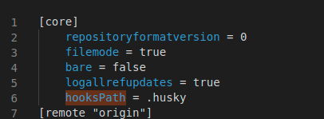

# Commit message

- When checkout branch, branch name must to contain ticket number
    EX:
    ```
    - feature/LT-6299-commit-message
    - fix/LT-6299-commit-message
    ```

- When commit message, `husky` will auto plus ticket-number in prefix commit message
    EX:
    ```bash
    git commit -m "add commit message"
    ```
    we will receive a message after that
    ```bash
    [LT-6299] add commit message
    ```


## When githook prepare-commit-msg does not work well

- Access `.git/config`
- Add `hooksPath = .husky`




